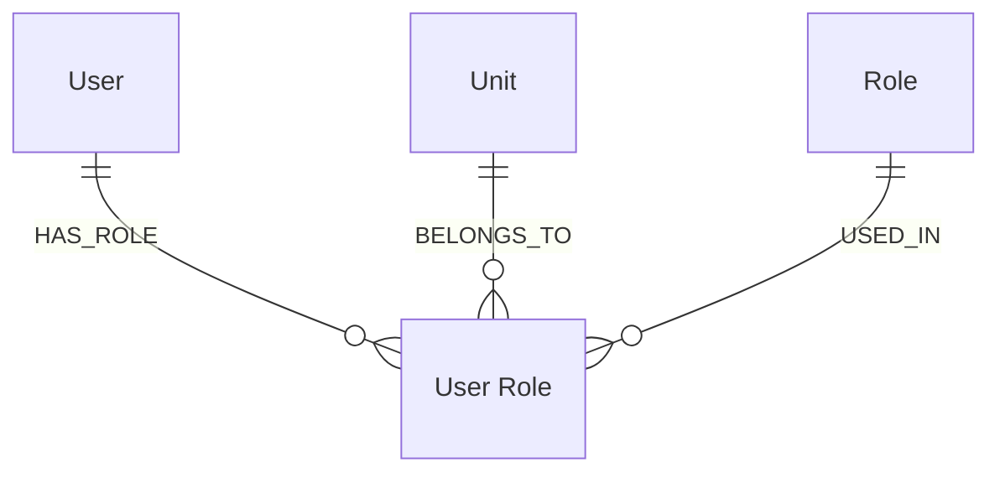

#  fullstack-spring-react-demo
 
Demo Spring Boot RESTful API demo application using Spring Web, Spring Data JPA, and H2 Database

## Part 1 – Backend

The task is to implement an application with a RESTful API based on the following data model:

**User**

| Id | Version | Name  |
|----|---------|-------|
| 1  | 1       | Alice |
| 2  | 2       | Bob   |
| 3  | 1       | Eve   |

**Unit** 

| Id | Version | Name                            |
|----|---------|---------------------------------|
| 11 | 2       | Kreftregisteret                 |
| 12 | 1       | Akershus universitetssykehus HF |
| 13 | 2       | Sørlandet sykehus HF            |
| 14 | 2       | Vestre Viken HF                 |

**Role** 

| Id  | Version | Name                        |
|-----|---------|-----------------------------|
| 101 | 1       | User administration         |
| 102 | 2       | Endoscopist administration  |
| 103 | 1       | Report colonoscopy capacity |
| 104 | 2       | Send invitations            |
| 105 | 1       | View statistics             |

**User Role**

| Id   | Version | Userld | Unitld | Roleld | ValidFrom           | ValidTo             |
|------|---------|--------|--------|--------|---------------------|---------------------|
| 1001 | 1       | 1      | 11     | 101    | 2019-01-02 00:00:00 | 2019-12-31 23:59:59 |
| 1002 | 2       | 1      | 11     | 104    | 2019-01-02 00:00:00 | 2019-12-31 23:59:59 |
| 1003 | 1       | 1      | 11     | 105    | 2019-06-11 00:00:00 | 2019-12-31 23:59:59 |
| 1004 | 2       | 2      | 12     | 101    | 2020-01-28 00:00:00 | (no value)          |
| 1005 | 1       | 2      | 12     | 105    | 2020-01-28 00:00:00 | (no value)          |
| 1006 | 1       | 2      | 14     | 101    | 2020-01-28 00:00:00 | (no value)          |
| 1007 | 1       | 2      | 14     | 102    | 2020-01-28 00:00:00 | (no value)          |
| 1008 | 1       | 1      | 11     | 101    | 2020-02-01 07:00:00 | (no value)          |
| 1009 | 1       | 1      | 11     | 104    | 2020-02-01 07:00:00 | (no value)          |

### Requirements

The application must provide storage for entries of all the above models, and the API must provide at least the following services:

1. General services for fetching all entries of any given model.
2. List only valid user roles for a given user id and unit id at a given timestamp
3. Create a new user
4. Update an existing user
5. Delete an existing user. A user can only be deleted if there are no user roles for that user.
6. Create a new user role for a given user id, unit id, role id, an optional valid from timestamp (if not specified, default to the current date and time) and an optional valid to timestamp (if not specified, default to no timestamp). 
   1. If a valid to timestamp is specified, it must be after the valid from timestamp (or the current date and time if valid from timestamp is not specified in the request).
   2. At most one user role for a given combination of user id, unit id and role id can be valid at any point in time.

7. Update an existing user role. 
   1. Only the valid from and valid to timestamps can be changed. 
   2. The valid from timestamp, if specified, must be a timestamp (a user role must always have a valid from timestamp). 
   3. The requirement that the valid to timestamp, if specified, must come after the valid from timestamp must be enforced. 
   4. An update that would cause two user roles for the same user id, unit id and role id to be valid at the same time must be rejected.

8. For a given unit id, list all users with at least one user role at that unit (whether the user role is currently valid or not), and for each user, list all the user's user roles at the given unit id.

Please note:

- Language, frameworks and libraries, build tools etc. may be freely chosen, but Java/Spring Boot is encouraged.
- Persistence/data storage may use an in-memory database.
- The candidate is encouraged to deliver any test code used, e.g. JUnit classes or curl scripts.
- Everything in the HTTP message body should be as JSON.
- When a new resource (user or user role) is created, it is automatically given an identifier (the next in the sequence for the shown types) and version 1.
- In requests that update or delete an existing resource, the version must always be specified. If the specified version does not match the resource's current version, a response indicating a version mismatch must be returned.
- Use the user, unit, role and user role data shown above as the starting state for every request.

## Part 2 – Frontend

Implement a single-page web application that consumes the API made in Part 1.

## Requirements

This app must be written in JavaScript/HTML; JS frameworks may be freely chosen but React is encouraged. Generally, the app should make use of all the services implemented in Part 1. This means the user interface must provide at least the following functionality:

1. Displaying results from searches in tables and/or lists.
2. Searching for
   1. users by name, unit, and/or role
   2. roles by name
   3. user roles by any related identifier, and/or date range.
   4. units by name or id.
3. Creating, updating, and deleting users.
4. Creating and updating user roles.

Please note:

- Decisions on GUI design, layout and style are left to the candidate.
- Proper handling of exceptions and errors is desired, whether they occur in the backend or frontend.
- We emphasize secure handling of input in the user interface.
- As with Part 1, we appreciate test code/scripts, but do not require it.
